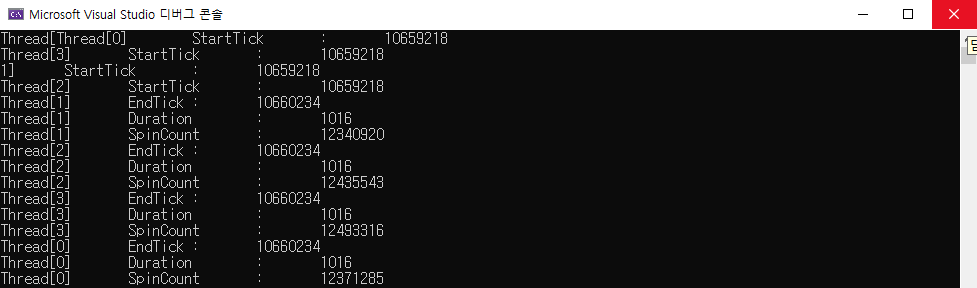
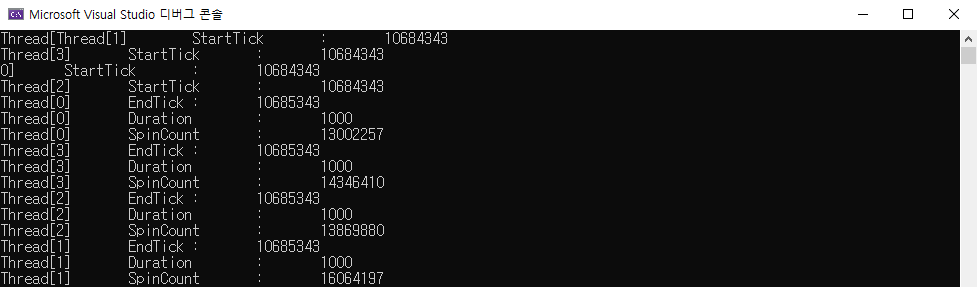
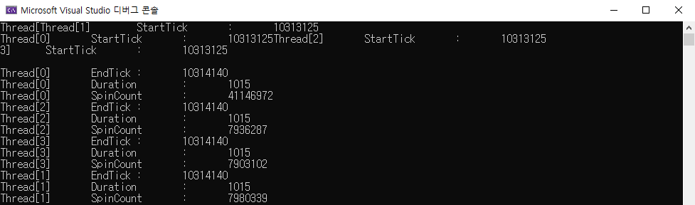
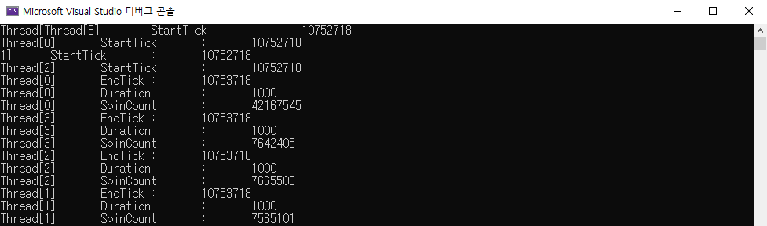

# Test-Sleep0

- Test how Sleep(0) affects threads.
- Verify "A value of zero causes the thread to relinquish the remainder of its time slice to any other thread that is ready to run." (Sleep function, microsoft docs) is true.

## Environment

- Window 10 sdk 10.0.22000.0
- Visual Studio 2022 (v143)
- ISO c++14
- Unicode

## Result

- Without Sleep(0)

- Sleep(0) in Thread[1], Thread[2], Thread[3]

- Average Spin Count per second (Without Sleep(0)) : 13442415
- Average Spin Count per second (Sleep(0)) : 7774584
- Average Spin Count per second (Thread not calling Sleep(0) when other threads calling Sleep(0)) : 41399713

In short,
- Calling Sleep(0) reduces waste of CPU time slice by roughly 42%.
- Awaken thread's CPU time slice boosts significantly. (by 308% when 3 threads calling Sleep(0))
