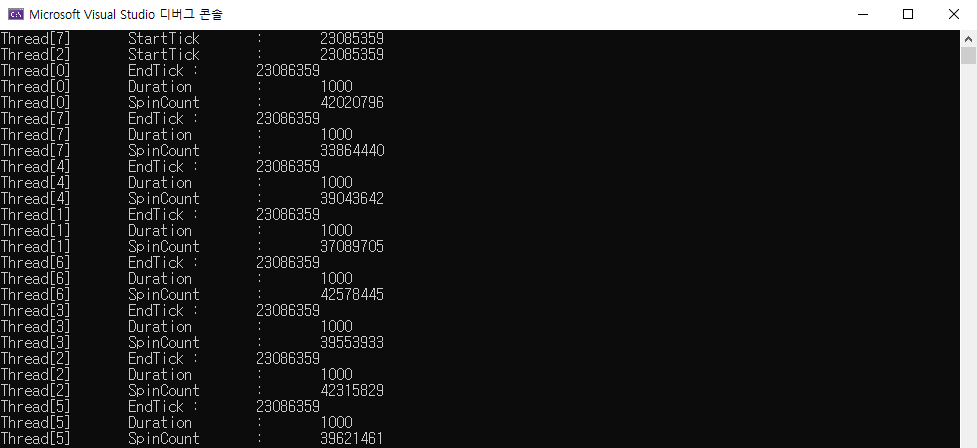
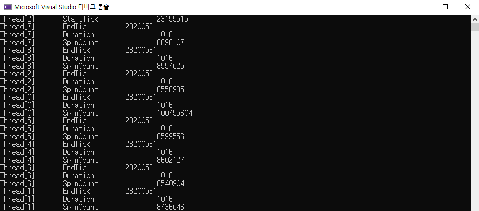

# Test-Sleep0

- Test how Sleep(0) affects threads.
- Verify following statement.

    >"A value of zero causes the thread to relinquish the remainder of its time slice to any other thread that is ready to run."
<https://docs.microsoft.com/en-us/windows/win32/api/synchapi/nf-synchapi-sleep>

## Environment

- Window 10 sdk 10.0.22000.0
- Visual Studio 2022 (v143)
- ISO c++14
- Unicode
- i7-10875h (8 core)

## Result

### 4 Threads

- Without Sleep(0)

- Sleep(0) in Thread[1], Thread[2], Thread[3]

- Average Spin Count per second (Without Sleep(0)) : 42572317
- Average Spin Count per second (Sleep(0)) : 8932267
- Spin Count per second (Thread not calling Sleep(0) when other threads calling Sleep(0)) : 104892470

- Sleep(0) Thread Rate : **42572317 -> 8932267 (21%)**
- Thread not calling Sleep(0) Spin Count Rate : **42572317 -> 104892470 (246%)**

### 8 Threads

- Without Sleep(0)

- Sleep(0) in Thread[1], Thread[2], Thread[3], Thread[4], Thread[5], Thread[6], Thread[7]

- Average Spin Count per second (Without Sleep(0)) : 39511031
- Average Spin Count per second (Sleep(0)) : 8575100
- Average Spin Count per second (Thread not calling Sleep(0) when other threads calling Sleep(0)) : 41399713

- Sleep(0) Thread : **39511031 -> 8575100 (21.7%)**
- Thread not calling Sleep(0) Spin Count Rate : **39511031 -> 100455604 (254%)**

**In short,**

**- Calling Sleep(0) significantly reduces waste of CPU time slice. (roughly reduced to 21%).**

**- The thread not calling Sleep(0) when other threads calling Sleep(0) gets significant CPU time slice boost. (roughly boosted to 250%)**
